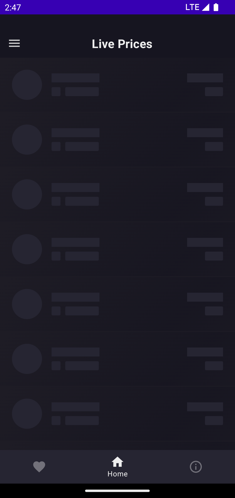

<h1 align="center">ICrypto</h1>

  
  
  

🎯 "ICrypto" app demonstrates modern Android app development with Jetpack Compose, Koin, WebSocket, Splash Screen, Material, Coroutines, Flows, PullToRefresh, based on MVI architecture. 

 

# Preview
### Light Mode
 

 
 
 
  

 

# Architecture

"ICrypto" is based on the MVI architecture pattern.

- ICrypto uses an open opi from [ByBit webSocket](https://www.bybit.com/)
- ICrypto uses Retrofit to make api requests to coinstats.
- ICrypto is made using Kotlin & Jetpack Compose and following Modern Android Development practices.
- ICrypto uses chart visuals library to view market changes by [MPAndroidCharts](https://github.com/PhilJay/MPAndroidChart)
- ICrypto uses Kotlin Coroutines and Flow to handle all asynchronous tasks.

## Built With 🛠
- [Kotlin](https://kotlinlang.org/) - First class and official programming language for Android development.
- [Jetpack Compose](https://developer.android.com/jetpack/compose) - Jetpack Compose is Android’s modern toolkit for building native UI
- [Coroutines](https://kotlinlang.org/docs/reference/coroutines-overview.html) - For asynchronous and more..
- [Flow](https://kotlin.github.io/kotlinx.coroutines/kotlinx-coroutines-core/kotlinx.coroutines.flow/-flow/) - A cold asynchronous data stream that sequentially emits values and completes normally or with an exception.
- [StateFlow](https://developer.android.com/kotlin/flow/stateflow-and-sharedflow) - StateFlow is a state-holder observable flow that emits the current and new state updates to its collectors.
- [Android Architecture Components](https://developer.android.com/topic/libraries/architecture) - Collection of libraries that help you design robust, testable, and maintainable apps.
    - [ViewModel](https://developer.android.com/topic/libraries/architecture/viewmodel) - Stores UI-related data that isn't destroyed on UI changes.
- [Dependency Injection](https://developer.android.com/training/dependency-injection) -
    - [Koin](https://insert-koin.io/) - The pragmatic Kotlin dependency injection framework
- [GSON](https://github.com/google/gson) - A modern JSON library for Kotlin and Java.
- [Retrofit](https://square.github.io/retrofit/) - A type-safe HTTP client for Android and Java.
- [Splash Screen API](https://developer.android.com/develop/ui/views/launch/splash-screen) - When a user launches an app while the app's process is not running (a cold start) or the Activity has not been created (a warm start), the following events occur.
- [GSON Converter](https://github.com/square/retrofit/tree/master/retrofit-converters/gson) - A Converter which uses Moshi for serialization to and from JSON.
- [Coil](https://github.com/coil-kt/coil) - An image loading library for Android backed by Kotlin Coroutines.
- [Material Components for Android](https://github.com/material-components/material-components-android) - Modular and customizable Material Design UI components for Android.
- [WebSocket](https://github.com/TooTallNate/Java-WebSocket) A barebones WebSocket client and server implementation written 100% in Java

 

## If this project helps you in anyway, show your love :heart: by putting a :star: on this project :v:

## Contributing

Please fork this repository and contribute back using
[pull requests](https://github.com/hamidfathi1998/ToDo/Icrypto).

Any contributions, large or small, major features, bug fixes, are welcomed and appreciated
but will be thoroughly reviewed .

### - Contact - Let's become friend
- [Github](https://github.com/hamidfathi1998)
- [Linkedin](https://www.linkedin.com/in/hamidfathi1998/)
